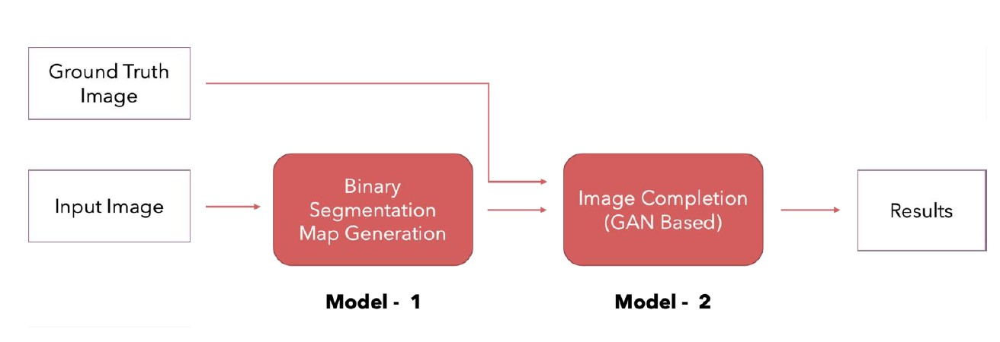
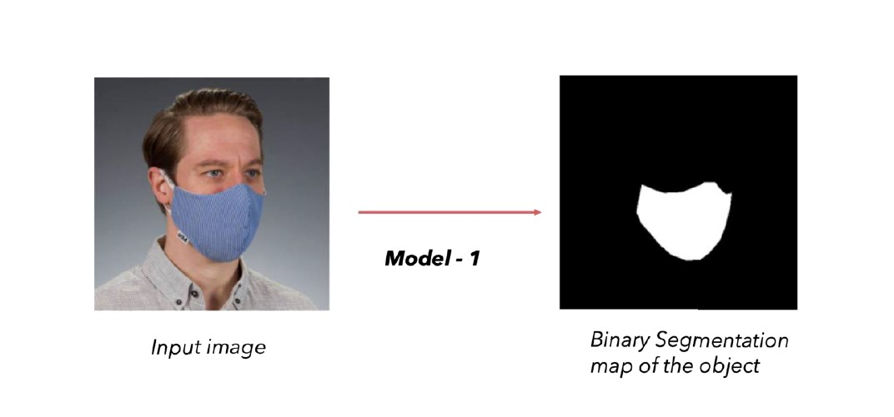

# Unmasking Human Faces - Project
---
The objective of this work is to remove mask objects in facial images. We break the problem into two stages: **mask object detection** and **image completion** of the removed mask region.

## Overview :pencil2:

## Mask Object Detection and Segmentation - Part 1 :mask:
---
- For this task we used Mask RCNN to detect the object (facemask) and generate binary segmentation maps and implemented this model using **detectron2**

## Image Completion - Part 2  🎭 🚧 (in progress)
---

- The goal of this model is to remove the mask and complete the left behind region in a way that is both structural and appearance wise consistent with the ground truth image.

- For this task, We are going through some state-of-the-art architectures such as **GAN** (generative adversarial network), autoencoders etc.
 
    :construction_worker::construction_worker::construction_worker::construction_worker:

    *We are currently working on this to find the best architecture for this task (facial inpainting)*

 

## To Do ✔️
---
- [x] Mask Object Detection and Segmentation
- [ ] Image Completion 
- [ ] Model Deployment   

## References :satellite: 
---
- For Pretrained models of object detection and segmentation [Detectron2](https://github.com/facebookresearch/detectron2)
- For Datal Labeling [labelflow](https://labelflow.ai/website)
- To Create Simulated Masked Dataset  [MaskTheFace](https://github.com/aqeelanwar/MaskTheFace)
- The Reference [Research paper](https://www.researchgate.net/publication/339643256_A_Novel_GAN-Based_Network_for_Unmasking_of_Masked_Face)
